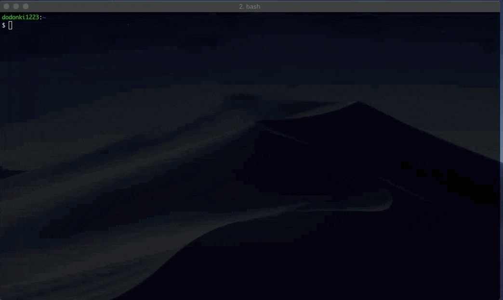

# QiitaTrend


[](https://badge.fury.io/rb/qiita_trend) [](https://github.com/dodonki1223/qiita_trend/blob/master/LICENSE.txt) [](https://circleci.com/gh/dodonki1223/qiita_trend/tree/master)

Qiitaのトレンドを10秒で取得することができます



## 概要

- [Qiita](https://qiita.com/)のTOPページをスクレイピングしDaily、Weekly、Monthlyのトレンドを取得します
- トレンドはDaily、Weekly、Monthlyそれぞれを日付と更新時間（5時と17時）の組み合わせごとにキャッシュを行います
- Weekly、Monthlyに関してはQiitaにログインしないと取得できないためユーザー名とパスワード設定する必要があります（Dailyに関しては何も設定しなくても取得できます）
- 過去のトレンドを取得することができます（**あくまでもキャッシュファイルから復元するためキャッシュファイルの無い過去のトレンドは取得することができません**）
- いいね数は性質上取得した時の時間に依存します。どうしても現在時刻のいいね数が欲しい場合はキャシュファイルを手動で削除してもう一度実行してください

## インストール

Add this line to your application's Gemfile:

```ruby
gem 'qiita_trend'
```

And then execute:

    $ bundle

Or install it yourself as:

    $ gem install qiita_trend

## 使用方法

### QiitaのDailyのトレンドを10秒で取得する

ターミナルでコマンド`gem install qiita_trend`、`ruby -r qiita_trend -e "pp QiitaTrend::Trend.new.items"`を実行することでQiitaのトレンドを10秒で取得できます  
**2019年8月2日08時00分頃に実行した結果です**

```shell
$ gem install qiita_trend
Fetching qiita_trend-0.2.3.gem
Successfully installed qiita_trend-0.2.3
Parsing documentation for qiita_trend-0.2.3
Installing ri documentation for qiita_trend-0.2.3
Done installing documentation for qiita_trend after 0 seconds
1 gem installed

$ ruby -r qiita_trend -e "pp QiitaTrend::Trend.new.items"
[{"title"=>"「ソースコード全部読まなきゃ病」と闘う方法",
  "user_name"=>"guitar_char",
  "user_image"=>
   "https://qiita-image-store.s3.amazonaws.com/0/114709/profile-,images/1473712681",
  "likes_count"=>130,
  "is_new_arrival"=>false,
  "article"=>"https://qiita.com/guitar_char/items/3b31f7cc79333120b452"},
 {"title"=>"恐竜でもわかるJavaScript",
  "user_name"=>"baby-degu",
  "user_image"=>
   "https://qiita-image-store.s3.ap-northeast-1.amazonaws.com/0/407975/profile-images/1557035044",
  "likes_count"=>129,
  "is_new_arrival"=>false,
  "article"=>"https://qiita.com/baby-degu/items/d1bf48b6595bab2fda6f"},
  ...
```

### ワンライナーで使ってみる

先に`gem install qiita_trend`を実行しておくこと

#### Dailyのトレンドの簡易表示

index + タイトル名 + いいね数 + ユーザー名

```shell
$ ruby -r qiita_trend -e "QiitaTrend::Trend.new.items.each_with_index {|t, i| puts '[' + i.to_s + ']' + t['title'] + '(' + t['likes_count'].to_s + ')' + ' - ' + t['user_name']}"

[0]「ソースコード全部読まなきゃ病」と闘う方法(130) - guitar_char
[1]恐竜でもわかるJavaScript(129) - baby-degu
[2]「ようこそ・・・『テストの世界』へ・・・」(168) - shonansurvivors
[3]水田の取水バルブを定点カメラで監視し、水田の水があるかないか、給水されているか否かを機械学習で識別してみた(114) - mix_dvd
[4]ハムスターの写真を撮りたい(84) - mk-takahashi
[5]CSSを非同期ロードする最も簡単な方法(64) - rana_kualu
```

#### Dailyのトレンドのタイトル一覧

```shell
$ ruby -r qiita_trend -e "QiitaTrend::Trend.new.items.each {|t| puts t['title']}"

「ソースコード全部読まなきゃ病」と闘う方法
恐竜でもわかるJavaScript
「ようこそ・・・『テストの世界』へ・・・」
水田の取水バルブを定点カメラで監視し、水田の水があるかないか、給水されているか否かを機械学習で識別してみた
ハムスターの写真を撮りたい
CSSを非同期ロードする最も簡単な方法
```

#### Dailyのトレンドのうち`new`がついているものをブラウザで一括で開く

```shell
$ ruby -r qiita_trend -e "QiitaTrend::Trend.new.new_items.each {|t| system('open ' + t['article'])}"
```

## 自分のプロジェクトで使用する

Gemfileにqiita_trendを追加する

```ruby
gem 'qiita_trend'
```

Gemfileに追加したら`bundle install`してください

### Dailyのトレンドを取得する

```ruby
daily_trend = QiitaTrend::Trend.new

# Dailyのトレンドを全て取得する
p daily_trend.items

# DailyのトレンドでNEWのものだけを取得する
p daily_trend.new_items
```

#### Weekly、Monthlyのトレンドを取得する

WeeklyとMonthlyのトレンドを取得する時はQiitaにログインしている必要があるため、ログイン出来るユーザーとパスワードの設定が必要です

```ruby
# Qiitaにログインするためのユーザーとパスワードの設定をする
QiitaTrend.configure do |config|
  config.user_name = 'ユーザー名'
  config.password = 'パスワード'
end

# Weeklyの全てのトレンドとNEWのものだけを取得
weekly_trend = QiitaTrend::Trend.new(QiitaTrend::TrendType::WEEKLY)
p weekly_trend.items
p weekly_trend.new_items

# Monthlyの全てのトレンドとNEWのものだけを取得
monthly_trend = QiitaTrend::Trend.new(QiitaTrend::TrendType::MONTHLY)
p monthly_trend.items
p monthly_trend.new_items
```

#### itemsメソッド、new_itemsメソッドについて

itemsメソッド、new_itemsメソッドは`Array`を返します
Array一つ一つは`Hash`になります

```shell
irb(main):002:0> QiitaTrend::Trend.new.items.class
=> Array
irb(main):003:0> QiitaTrend::Trend.new.items[0].class
=> Hash
```

Hashは以下の構成になっています

```shell
irb(main):004:0> pp QiitaTrend::Trend.new.items[0]
{"title"=>"「ソースコード全部読まなきゃ病」と闘う方法",
 "user_name"=>"guitar_char",
 "user_image"=>
  "https://qiita-image-store.s3.amazonaws.com/0/114709/profile-images/1473712681",
 "likes_count"=>130,
 "is_new_arrival"=>false,
 "article"=>"https://qiita.com/guitar_char/items/3b31f7cc79333120b452"}
```

| key            |  内容                     | 備考                  |
|:--------------:|:-------------------------:|:---------------------:|
| user_name      | ユーザー名                |                       |
| user_image     | ユーザー画像URL           |                       |
| likes_count    | いいね数                  | 数値が入ります        |
| is_new_arrival | 「NEW」のついている記事か | TrueかFalseが入ります |
| article        | 記事のURL                 |                       |

#### キャシュファイルの出力先を変更する

キャッシュファイルはデフォルトだと`ユーザーのHOMEディレクトリ/qiita_cache/`に出力されます

```
/Users/dodonki1223/qiita_cache/2019080205_daily.html
/Users/dodonki1223/qiita_cache/2019080205_weekly
/Users/dodonki1223/qiita_cache/2019080205_monthly.html
```
 
プログラムで下記のように追記してください

```ruby
# キャッシュの出力先ディレクトリを変更する
# ユーザーのHOMEディレクトリ配下のhogeディレクトリに出力する設定
# /Users/dodonki1223/hoge/
QiitaTrend.configure do |config|
  config.cache_directory = Dir.home + '/hoge/'
end
```
